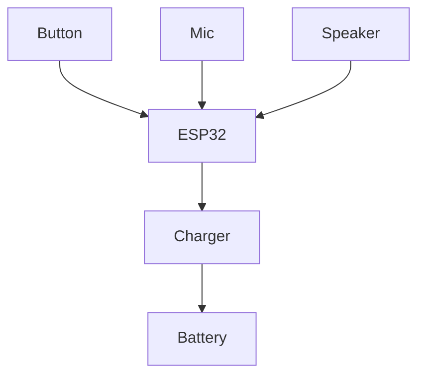

# Sigma S1 Assembly Guide

This guide explains how to build the Sigma S1 push‑to‑talk device.  The design
uses an ESP32‑WROOM module, an electret microphone, an 8 Ω speaker, and a
protected Li-ion pack housed in a 3D-printed enclosure.

The case features a 10 mm lanyard hole that runs front-to-back just below the top
surface and sits 6 mm from the left edge so standard paracord loops clear the
shell without rubbing on the enclosure.

See [`hardware/scad/sigma-s1-enclosure.scad`](../hardware/scad/sigma-s1-enclosure.scad)
for the OpenSCAD model and [`hardware/inputs/enclosure.json`](../hardware/inputs/enclosure.json)
for tunable parameters.

## Bill of materials

| Item | Part number | Notes | Tolerance |
| --- | --- | --- | --- |
| ESP32 module | Espressif ESP32-WROOM-32E | Pre-certified Wi-Fi/BT module | ±0.1 mm keep-out |
| Microphone | CUI CMA-4544PF-W | Electret capsule, top port | Bias 2.0–3.0 V |
| Speaker | CUI CDS-16008 | 16 mm diameter, 8 Ω | ±0.2 mm pocket |
| Push button | E-switch TL3305 | 6×6 mm tact switch | Ensure 0.1 mm clearance |
| Battery | 3.7 V Li-ion 500 mAh w/ PCM | JST-PH connector | Use PCM-protected cells |
| Charging PCB | TP4056-based USB-C | Integrated protection | Keep thermals <55 °C |
| Fasteners | M2×6 self-tapping screws | Qty 4 | Pilot holes 1.6 mm |

## Print profile

- Material: PETG (preferred for heat tolerance) or PLA+ for prototypes.
- Layer height: 0.2 mm; shell thickness ≥3 perimeters.
- Infill: 20 % gyroid.
- Supports: tree supports for the USB-C cutout only.
- Bed temperature: 80 °C (PETG) / 60 °C (PLA+).
- Nozzle temperature: follow filament vendor guidance (240 °C PETG, 210 °C PLA+).

## Exploded assembly reference

```
     ┌─────────┐
     │  top    │
     │ enclosure┐
┌────┴────┐   │ │
│ speaker │   │ │
└────┬────┘   │ │
     │   push button
┌────┴────────────┐
│  ESP32 module   │
└────┬────────────┘
     │  wiring loom
┌────┴───────────┐
│ Li-ion battery │
└────┬───────────┘
     │  charging PCB
┌────┴───────────┐
│ bottom shell   │
└────────────────┘
```

## Printing the case

1. Edit `hardware/inputs/enclosure.json` if you need alternative wall thickness
   or component offsets.
2. Run `bash scripts/build_stl.sh` to regenerate STLs and the checksum manifest.
3. Print `hardware/stl/sigma-s1-enclosure.stl` using the profile above.

## Wiring diagram



Route the microphone and speaker wires through the side openings before closing
the shell. Keep wiring away from the lanyard channel so the strap threads
smoothly.

## Assembly steps

1. Solder the microphone and speaker leads to the ESP32.
2. Attach the push button to a GPIO pin and ground.
3. Mount the ESP32 using adhesive foam or standoffs.
4. Seat the Li-ion pack and charging PCB in the lower bay.
5. Close the enclosure with the four M2 screws.
6. Thread the lanyard and verify the button toggles the status LED per the
   firmware boot log safety prompts.

## Preview the model

Use the interactive viewer in [`viewer/`](../viewer) to inspect the STL in your
browser. Serve the repository locally (`npm install && npm run dev` from the
`viewer/` directory) to launch the preview.
